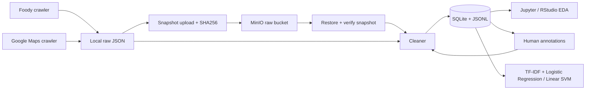

# ADY201m — Foody / Google Maps Sentiment Analysis

Dữ liệu do nhóm tự crawl. Pipeline chuẩn hóa review, lưu Data Lake/SQLite, kiểm tra chất lượng và chuẩn bị hai baseline sentiment. Đây là dự án đang phát triển; nhãn người và đánh giá nghiên cứu chưa hoàn thành.

## Chạy local trên Windows

Khuyến nghị môi trường riêng Python 3.11 và Chrome được cài. Code xử lý/ML đã được kiểm thử bằng Python 3.13 trong đợt rà soát; môi trường Docker định nghĩa Python 3.11 nhưng chưa được build ở đây.

```powershell
python -m venv .venv
.\.venv\Scripts\Activate.ps1
python -m pip install -r requirements.txt
python src/ingestion/main.py --preprocess --preprocess-config configs/preprocessing.json
```

Main chạy Foody và Maps trong hai worker riêng. `--source foody` / `--source gmap` chọn nguồn. Cấu hình vùng Maps ở `src/ingestion/gmap_areas.json`; target là số địa điểm muốn xử lý, không có nghĩa đã có dữ liệu đủ từng địa điểm. Ctrl+C yêu cầu các worker dừng, lưu trạng thái; chờ đóng Chrome. Bản sửa Foody gộp dữ liệu cũ trước khi lưu, chỉ lấy URL cùng vùng. Foody mở trang `/binh-luan`, cuộn tối đa 400px mỗi lượt, nghỉ 1,5–2,5 giây; bấm nút tải thêm danh sách review và chờ HTML ổn định 6–20 giây. Dừng sau ba lần xác nhận cuối trang không tiến triển, tối đa 100 lượt hoặc 600 giây. Dữ liệu gồm review đã tải vào DOM, chưa coi đó là toàn bộ review mỗi quán.

### Tiếp tục checkpoint

Mặc định chạy lại **cùng lệnh và cùng `--output-dir`** sẽ tiếp tục tiến độ. Mỗi nguồn có `places_queue.json` riêng trong `data/raw/foody` và `data/raw/gmap`. Không xóa các file này hoặc file dữ liệu đi kèm nếu muốn tiếp tục.

- **Foody:** lưu URL trong lúc tìm quán, lưu review khi danh sách đang tải tăng lên và cập nhật trạng thái sau từng quán. Quán `processed` có dữ liệu trên đĩa được bỏ qua; trạng thái này chỉ xác nhận đã xử lý đến cuối danh sách tải được. Quán chạm giới hạn cuộn/thời gian hoặc chưa tải được review giữ trạng thái `partial`. Dataset cũ chưa có hàng đợi sẽ được kiểm tra lại một lần để thiết lập checkpoint, đồng thời giữ và gộp dữ liệu cũ.
- **Google Maps:** dùng hàng đợi cùng các file `.partial.json` và `.status.json` sẵn có; bỏ qua quán hoàn tất hoặc đã xác nhận không có review. Checkpoint vẫn giữ review cũ khi dừng giữa một lượt `--refresh`.
- **Thứ tự tiếp tục:** ưu tiên quán đang chạy khi bị ngắt, rồi quán chưa chạy, sau đó thử lại quán dang dở/lỗi theo vị trí đã lưu. Foody áp dụng trong từng khu vực. Log ghi rõ các quán được bỏ qua.

Checkpoint lưu dữ liệu và tiến độ hàng đợi, không lưu phiên Chrome hoặc vị trí cuộn có thể khôi phục trực tiếp. Khi tiếp tục một quán dang dở, trình duyệt vẫn phải mở lại trang và cuộn qua phần đã xem; review trùng được gộp. Khi tiến trình bị tắt cưỡng bức, phần đã ghi xong trên đĩa được giữ; HTML chưa kịp ghi có thể phải tải lại.

Muốn chủ động cào lại các quán đã xử lý, thêm `--refresh` (có thể kết hợp `--source foody` hoặc `--source gmap`); dữ liệu lịch sử vẫn được giữ:

```powershell
python src/ingestion/main.py
python src/ingestion/main.py --source foody --refresh
```

### Đầu ra JSON Foody

Mỗi phần tử trong `data/raw/foody/foody_<thành-phố>_dataset.json` là một bình luận, kèm thông tin quán tại thời điểm crawl. Ngoài các trường review hiện có, crawler xuất `Số Ảnh Bình Luận`, các điểm `Vị Trí`, `Giá Cả`, `Chất Lượng`, `Phục Vụ`, `Không Gian`, `Điểm Trung Bình Quán`, `Giờ Mở Cửa`, `Giờ Đóng Cửa`, `Giá Thấp Nhất`, `Giá Cao Nhất`, `Lượt Xem`, `Tổng Số Bình Luận` và số bình luận `Tuyệt Vời`, `Khá Tốt`, `Trung Bình`, `Kém` (tên khóa đầy đủ như mẫu yêu cầu).

Điểm thành phần là số thực; giá VNĐ và các bộ đếm là số nguyên; giờ là chuỗi `HH:MM` của khoảng giờ đầu tiên trang hiển thị. Các trường bổ sung không đọc được ghi `null`, còn số 0 thực tế vẫn giữ nguyên. `Điểm Đánh Giá` giữ kiểu chuỗi. Số ảnh lấy từ `TotalPictures` của bình luận, không đếm ảnh xem trước; lượt xem dạng `26.1K` được đổi thành `26100` theo độ chính xác trang công bố. Tổng số bình luận là thống kê của quán, không phải số review crawler tải được. Các trường nguồn, tên quán, thang điểm và thời điểm thu thập vẫn được giữ.

Dùng `python src/ingestion/main.py --source foody --refresh` để đọc lại các quán đã xử lý và bổ sung trường cho những review tải lại được. Review lịch sử không còn tải được giữ nguyên; dữ liệu cũ không tự có các trường mới nếu chỉ bỏ qua checkpoint.

### Google Maps: hồ sơ đăng nhập và diagnostics

Dùng cùng một thư mục hồ sơ Chrome cho bước đăng nhập và bước crawl. Không mở đồng thời hai crawler bằng cùng hồ sơ. Khi cần đăng nhập lại, chạy từ thư mục dự án và thay đường dẫn mẫu bằng hồ sơ thực tế:

```powershell
python src/ingestion/gmap_pipeline.py --login --profile-dir "DUONG_DAN_HO_SO"
python src/ingestion/main.py --source gmap --gmap-profile-dir "DUONG_DAN_HO_SO"
```

Crawler xác nhận danh sách đánh giá đầy đủ qua bộ điều khiển sắp xếp, không coi 3–5 review xem trước là đủ. Nếu giao diện chưa sẵn sàng, crawler thử mở lại và tải lại trang tối đa một lần trong mỗi lần mở danh sách. Nếu Google vẫn yêu cầu đăng nhập, lỗi `ReviewAccessError` hướng dẫn dùng đúng hồ sơ; tăng thời gian chờ không thay thế được đăng nhập.

Khi tiếp tục checkpoint, crawler cho phép cuộn qua các ID đã lưu để tới review mới, vẫn giới hạn tổng thời gian mỗi quán. Các trạng thái `partial` cũng lưu diagnostics gồm tab đang chọn, lịch sử mở danh sách và vị trí cuộn. Batch vẫn dừng sau ba quán lỗi liên tiếp để tránh lặp lỗi trên toàn bộ hàng đợi. Xem `reports/AUDIT_20260928.md` để phân biệt kiểm thử tự động với kết quả crawl trực tiếp.

Chỉ tiền xử lý dữ liệu hiện có:

```powershell
python src/processing/cleaner.py --config configs/preprocessing.json
```

Input trong `data/raw/foody` và `data/raw/gmap`; giữ nguyên raw. Output mới nhất được chỉ bởi `data/processed/latest.json`, nằm tại `runs/<run_id>/`. Không sửa trực tiếp snapshot. Xem [hướng dẫn tiền xử lý và gán nhãn](src/processing/README.md) và [Data Dictionary](src/processing/DATA_DICTIONARY.md).

## Kiến trúc



SQLite được mount volume theo phương án môn học cho phép; không cần một server DB riêng. Nhánh local raw→cleaner dùng khi chưa chạy Data Lake. Để chứng minh Report 2 cần chạy nhánh MinIO thật và lưu bằng chứng.

## MinIO / Docker Compose

Copy `.env.example` thành `.env` rồi điền thông tin đăng nhập riêng. `.env` không được commit. Cài/chạy Docker trước; Compose chỉ expose cổng localhost.

```powershell
docker compose up -d --build minio
docker compose run --rm --build app python -m src.storage.lake upload
docker compose run --rm app
```

Lệnh app cuối đọc snapshot hoàn tất mới nhất **từ MinIO**, kiểm tra hash, xử lý rồi ghi SQLite/JSONL vào volume processed. Upload raw mới bằng lệnh upload mỗi khi muốn chụp một đợt crawl mới. Crawler chạy trên Windows; image app không kèm Chrome. CLI storage đọc biến môi trường; Compose đọc `.env` rồi truyền chúng vào container. [Hướng dẫn hạ tầng](docker/README.md) mô tả snapshot_id, restore và RStudio.

Docker CLI không có trong môi trường rà soát: chưa xác nhận build image, kết nối MinIO thật hoặc RStudio. Adapter MinIO đã được kiểm thử offline bằng mock, bao gồm luồng upload→download→SQLite. Không coi kiểm thử này thay cho demo Docker thật.

## EDA và modeling

```powershell
python -m pip install -r requirements-analysis.txt
python -m jupyter lab
python src/modeling/model.py --weak-baseline
```

Hai notebook nằm trong `notebooks`; RStudio dùng `3_EDA.Rmd`. `weak-baseline` chỉ huấn luyện thử trên nhãn suy từ rating, không xuất accuracy/F1 đánh giá. Khi đã gán nhãn người và nhập lại bằng cleaner, chạy:

```powershell
python src/modeling/model.py --snapshot data/processed/runs/RUN_ID
```

Hai model được so sánh trên validation; model chọn bằng validation mới được chấm trên test. Chỉ text làm input; model kiểm tra nhãn, nhóm quán và ID trùng qua split. Xem [quy tắc modeling](src/modeling/README.md). Không dùng nhãn rating làm ground truth cho cảm xúc văn bản. Chưa có model dự báo xu hướng thời gian.

## Kiểm thử và tình trạng dữ liệu

```powershell
python -m unittest discover -s tests -v
python -m unittest discover -s src/processing -p test_cleaner.py -v
```

Lần rà soát 23/09/2026: raw hiện có 211 dòng, còn209 review duy nhất (24 Foody+185 Maps),191 mẫu văn bản đủ điều kiện,89 weak_train,8 ID quán. Chưa có nhãn người;155 review thiếu city,185 Maps thiếu ngày đăng chính xác, test hiện chưa có quán. Cần crawl thêm quán và gán nhãn trước khi đánh giá chính thức.

Foody cũ từng ghi đè dữ liệu mỗi lần chạy. Archive chuẩn hóa từ lần22/09 vẫn có410 review, được lưu riêng tại `data/recovery/2026-09-22` để đối chiếu. Đây không phải raw nguyên byte và chưa trộn lại vào dataset hiện tại. Xem [recovery note](data/recovery/README.md).

`.gitignore` loại raw/processed/models/annotations/browser profiles; chỉ đưa mẫu đã duyệt vào `data/samples`. Các file đã được Git track từ trước không tự được untrack bởi ignore; kiểm tra trước commit. Không có commit hoặc push tự động trong đợt rà soát. Duy trì lịch commit theo yêu cầu môn.

Xem [kế hoạch nghiên cứu và việc còn thiếu theo report](reports/RESEARCH_PLAN.md), [báo cáo rà soát](reports/PROJECT_AUDIT.md), và [AI log](AI_Log.md).


### Cập nhật 28/09/2026: diagnostics và MinIO

ChromeDriver có giới hạn chờ lệnh 30 giây, điều hướng 65 giây và không tự retry HTTP; diagnostics dùng ngân sách 12 giây, không làm mất trạng thái partial. Phiên hỏng được thay trước khi crawl quán tiếp theo.

Sau khi crawler dừng, tạo snapshot sạch rồi tải lên MinIO từ máy local:

```powershell
python src/processing/cleaner.py --config configs/preprocessing.json
$snapshot = (Get-Content data/processed/latest.json -Raw | ConvertFrom-Json).path
python -m src.storage.lake --env-file .env upload
python -m src.storage.lake --env-file .env upload-processed --snapshot-dir "$snapshot"
```

`raw/` giữ nguồn gốc; `processed/` chứa dữ liệu chuẩn hóa, khử trùng và các tập huấn luyện. Hai nhánh có `latest.json` riêng. Upload processed kiểm tra SHA-256 từng file sau khi tải và chỉ cập nhật con trỏ cuối cùng khi tất cả đã đạt. Đợt 28/09 dùng bản chụp cố định của raw để raw và processed khớp hoàn toàn; không chạy upload/cleaner đồng thời với crawler nếu muốn tái lập đúng cùng một đầu vào.
