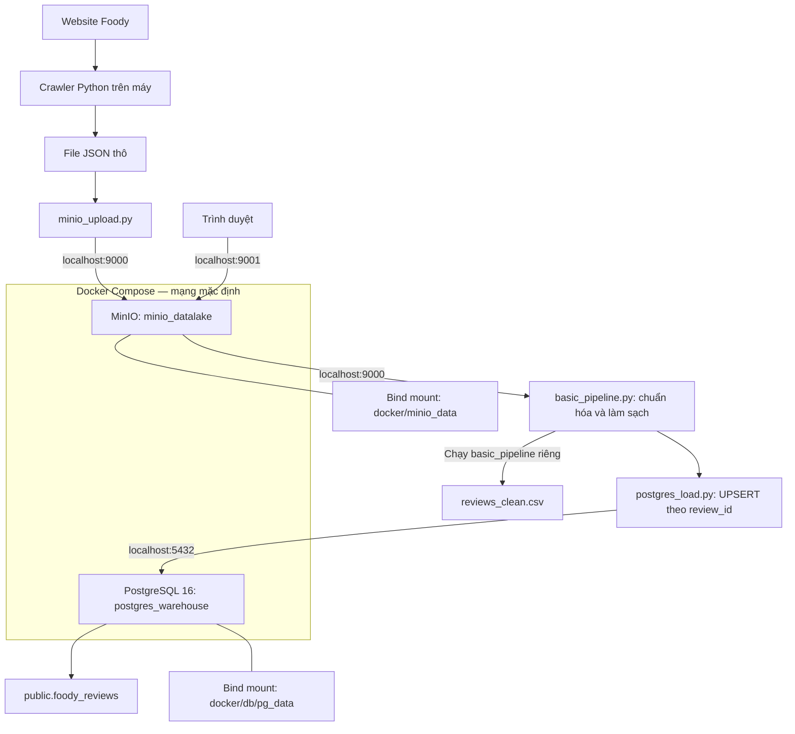

# Kiến trúc Docker và pipeline dữ liệu



Python hiện chạy trên máy; Docker Compose chỉ chạy MinIO và PostgreSQL.
Hai kho không tự truyền dữ liệu: Python đọc từ MinIO rồi ghi vào PostgreSQL.

## Chạy bước nạp database

Dùng Python 3.10 trở lên, tại thư mục gốc dự án:

```powershell
python -m pip install -r requirements.txt
docker compose up -d
python -m src.utils.postgres_load
```

Bucket `foody-raw-data` phải tồn tại và chứa JSON đã tải lên.
`.env` dùng các biến hiện có: `POSTGRES_DB`, `POSTGRES_USER`,
`POSTGRES_PASSWORD`, `MINIO_ROOT_USER`, `MINIO_ROOT_PASSWORD`.
Các biến tùy chọn: `POSTGRES_HOST` (mặc định `localhost`),
`POSTGRES_PORT` (`5432`), `MINIO_ENDPOINT` (`localhost:9000`),
`MINIO_RAW_BUCKET` (`foody-raw-data`). Nếu đưa Python vào cùng mạng Docker,
đặt `POSTGRES_HOST=postgres` và `MINIO_ENDPOINT=minio:9000`.

Loader tạo bảng `public.foody_reviews` nếu chưa có, với các cột từ pipeline
và `updated_at`. Bảng đã tồn tại phải có schema tương thích; loader không
tự sửa schema cũ. `review_id` là khóa chính: ID mới được thêm, ID có sẵn
được cập nhật. NaN/NaT chuyển thành SQL NULL. Hai điểm `teencode_score` và
`spelling_error_rate` đã có được giữ khi pipeline trả về NULL.
Toàn bộ lần nạp nằm trong một transaction; lỗi sẽ rollback.
Không xóa các review vắng mặt trong lần nạp hiện tại.

Khóa review hiện được tạo từ shop_id, tên người dùng và thời gian bình luận.
Hai bình luận trùng cả ba giá trị sẽ được coi là cùng một review.
Crawler lưu JSON theo thư mục chạy; uploader tìm ở `src/ingestion` nên
cần đặt file vào đúng đường dẫn trước khi upload.

`requirements.txt` chứa thư viện cho bước MinIO → xử lý → PostgreSQL;
crawler có các thư viện trình duyệt riêng.
